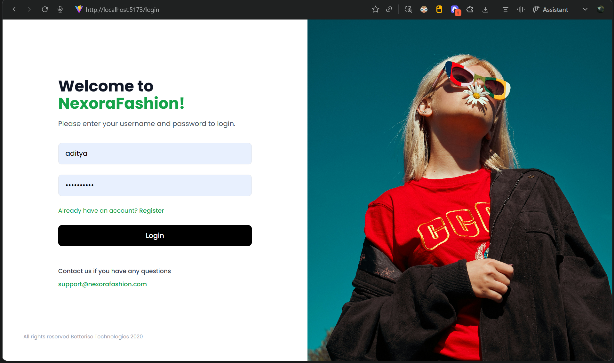
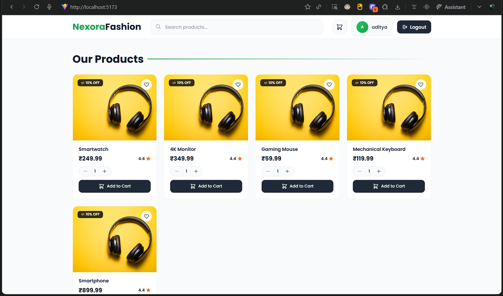
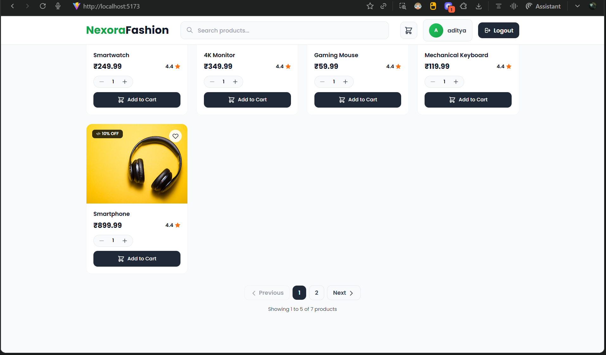
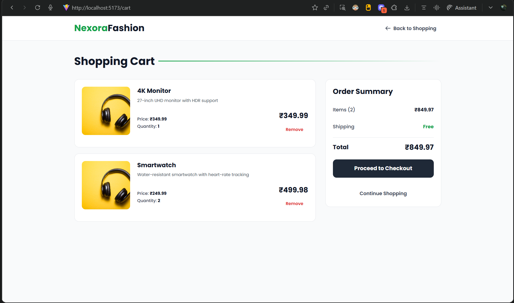
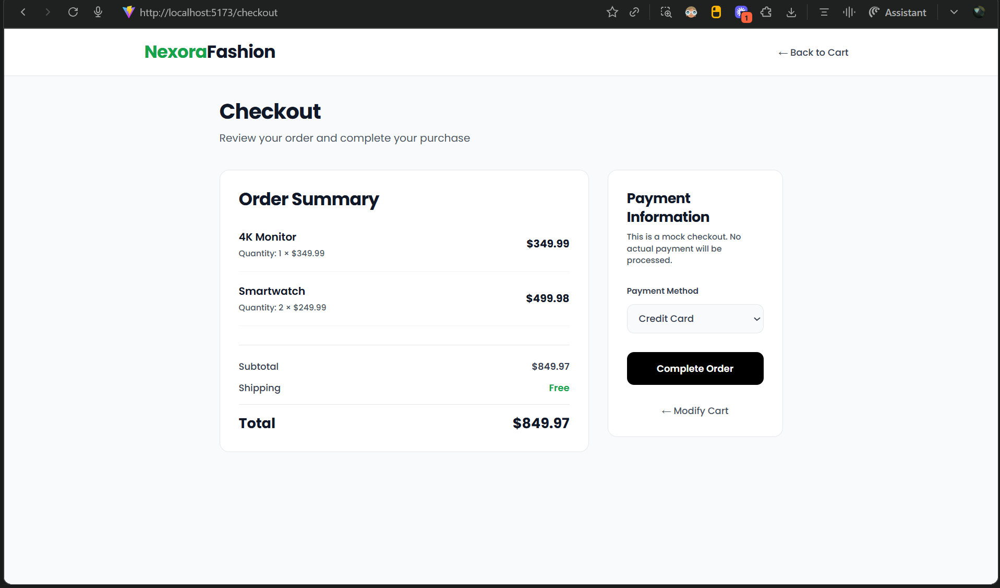
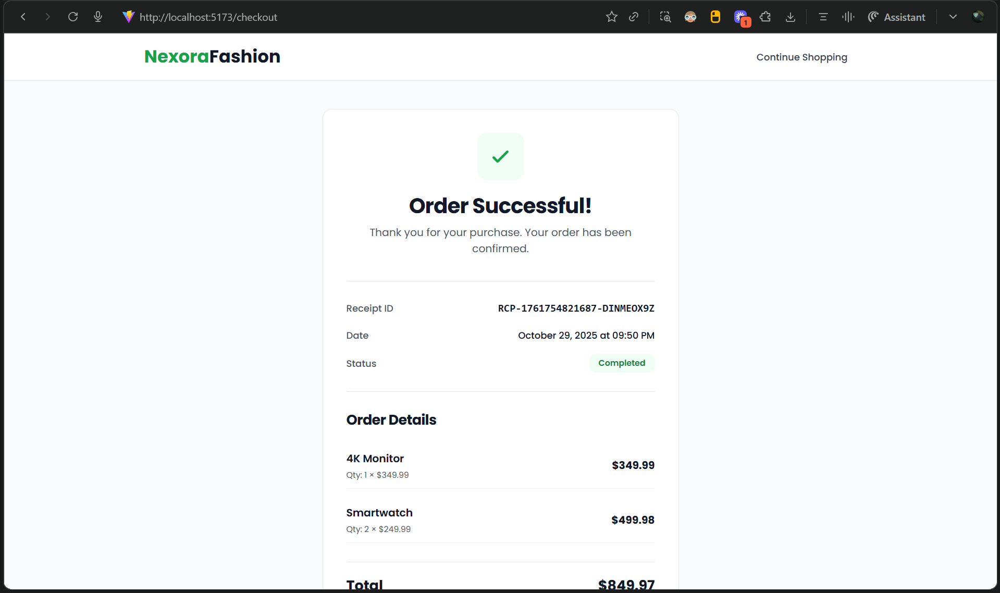

# 🛍️ NexoraFashion

**NexoraFashion** is a modern, full-stack **e-commerce application** built with **React** and **Node.js**. It enables users to register, sign in securely, browse products, manage their shopping cart, and complete purchases through a clean, responsive UI. The application features JWT-based authentication, product pagination, real-time cart management, and order processing with receipt generation.

---

## 🚀 Features

✅ **User Registration & Login** – Secure signup and login system with form validations and JWT authentication

✅ **Product Browsing** – Beautiful product catalog with search functionality and pagination

✅ **Shopping Cart Management** – Add, view, update quantities, and remove items from cart with real-time totals

✅ **Checkout & Order Processing** – Complete checkout flow with order confirmation and receipt generation

✅ **Modern Tech Stack** – Built using **React** with **Vite**, **Express.js**, and **MongoDB**

✅ **Authentication-ready** – JWT-based authentication with protected routes

✅ **Toast Notifications** – User-friendly notifications for all actions using react-hot-toast

✅ **Product Search** – Real-time search functionality to find products quickly

✅ **Order Receipts** – Detailed order confirmation with receipt ID, timestamp, and itemized breakdown

---

## 🛠 Tech Stack

- **Frontend:**

  - React with Vite
  - Tailwind CSS for styling
  - Axios for API calls
  - React Hot Toast for notifications

- **Backend:**

  - Node.js with Express.js
  - MongoDB with Mongoose
  - JWT for authentication

- **Database:**
  - MongoDB

---

## 🖼 Screenshots

| Screenshot                                 | Description                                                    |
| ------------------------------------------ | -------------------------------------------------------------- |
|             | Clean and modern user login interface with split-screen design |
|  | Product catalog homepage with search bar and product grid      |
|  | Product listing with pagination and quantity selector          |
|               | Shopping cart with item details, quantities, and order summary |
|       | Checkout page with order review and payment method selection   |
|         | Order confirmation receipt with transaction details            |

---

## 📦 Installation

### 🔧 Prerequisites

Make sure you have:

- Node.js (v18+ recommended)
- npm or yarn
- MongoDB (local or Atlas)

---

### 🚀 Local Setup

#### Backend Setup

```bash
# Navigate to backend directory
cd backendjs

# Install dependencies
npm install

# Start the backend server (default port: 8000)
npm start
# or use nodemon for development
npx nodemon app.js
```

#### Frontend Setup

```bash
# Navigate to frontend directory
cd frontend

# Install dependencies
npm install

# Start development server (default port: 5173)
npm run dev
```

---

## 📚 API Documentation

The backend API documentation is available in `backendjs/API_DOCUMENTATION.md`. It includes:

- Authentication endpoints (register, login, logout)
- Product endpoints (create, list with pagination)
- Cart endpoints (add, get, remove items)
- Checkout endpoints (process order)

All endpoints (except product listing and authentication) require JWT authentication via Bearer token.

---

## 🧠 Roadmap

- [ ] User profile management and order history
- [ ] Product categories and filtering
- [ ] Product reviews and ratings
- [ ] Wishlist functionality
- [ ] Email notifications for orders
- [ ] Payment gateway integration
- [ ] Admin dashboard for product management
- [ ] Image upload for products
- [ ] Order tracking system
- [ ] Multi-currency support

---

## 📝 Project Structure

```
assign/
├── backendjs/              # Backend API server
│   ├── config/            # Database and JWT configuration
│   ├── controllers/       # Route controllers
│   ├── models/            # MongoDB models (User, Product, Cart)
│   ├── services/          # Business logic services
│   ├── utils/             # Utility functions (auth middleware, JWT)
│   ├── app.js             # Express app entry point
│   └── API_DOCUMENTATION.md
│
└── frontend/               # React frontend application
    ├── src/
    │   ├── components/    # Reusable React components
    │   ├── pages/         # Page components (Home, Cart, Checkout, etc.)
    │   ├── services/      # API service functions
    │   └── assets/        # Images and static assets
    └── public/            # Public static files
```

---

## 🔐 Authentication

The application uses JWT (JSON Web Tokens) for authentication. After successful login, the token is stored in localStorage and automatically included in API requests. Protected routes verify the token before allowing access.
